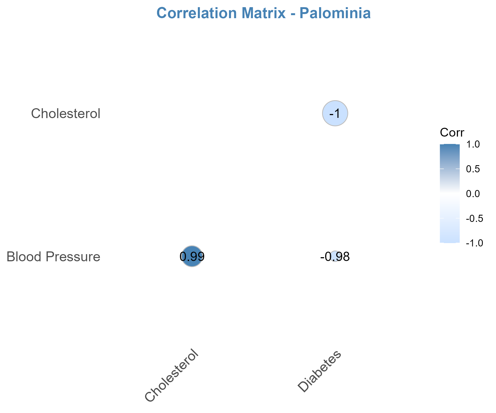
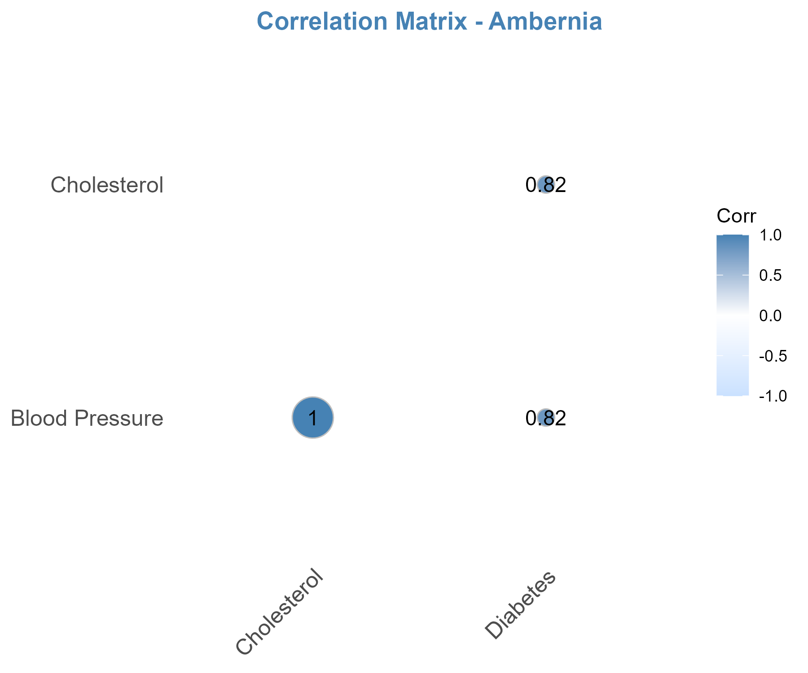
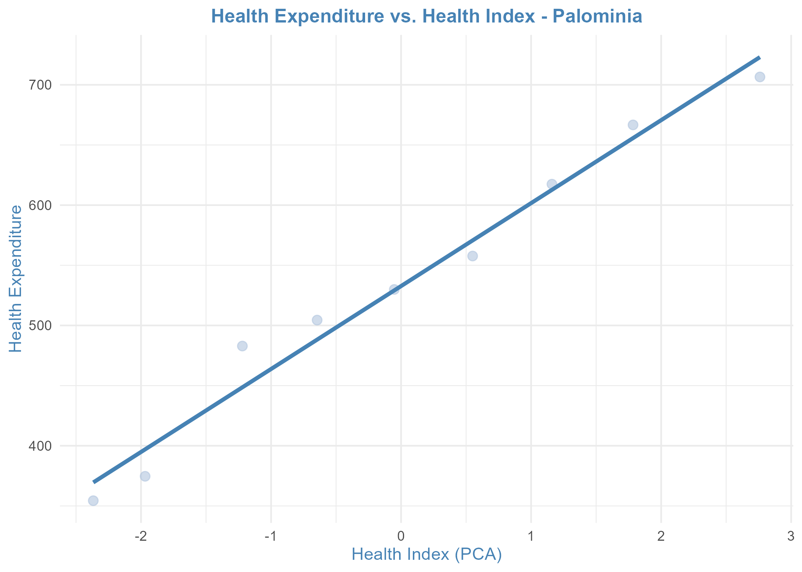
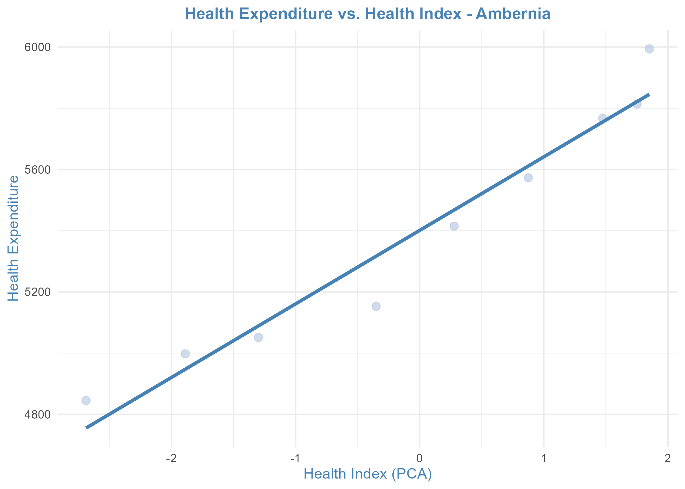
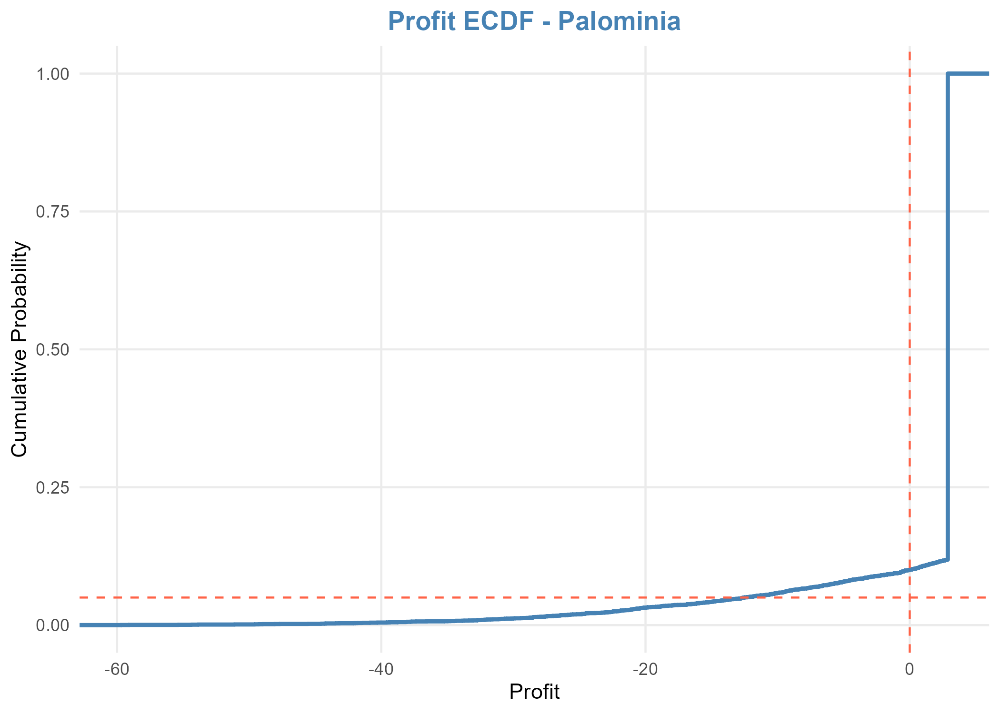
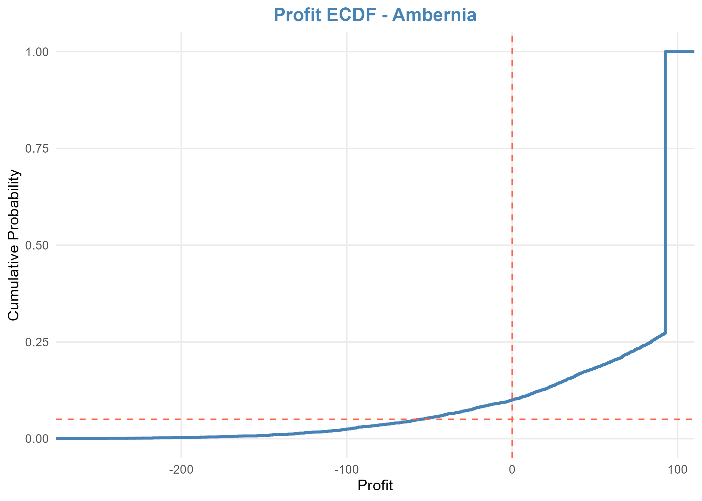

# 1. Background

In recent years, public healthcare systems around the world—especially
in developing countries—have frequently faced sudden financial strain
due to emergency public health events such as extreme temperatures,
localized disease outbreaks, or unexpected increases in chronic
illnesses within the population. These situations often push public
hospitals, emergency response units, and local ministries of health into
budget overloads, as operational, response, and healthcare service costs
escalate beyond forecasts. Meanwhile, traditional insurance products
have proven ineffective in providing timely financial support, as they
require complex damage assessments, lengthy payout processes, and only
cover direct losses within limited scope.

# 2. Introduction to the ParamCare Product

To address this protection gap, we introduce the ParamCare product –
Parametric Insurance for Public Healthcare Costs. This is a specially
designed insurance product aimed at providing rapid financial support to
public health organizations and governments when significant
fluctuations in public health risks occur. It is not a traditional
insurance product based on proving actual losses but a parametric
insurance model where payouts are triggered based on predefined
measurable indices established in the contract.

# 3. Target Customers

ParamCare is aimed at institutional clients at the system level:
national ministries of health, local governments, emergency medical
response funds, public hospitals, and healthcare network management
units. The product does not target individuals but rather communities
and geographic regions—where a shift in public health indicators can
lead to a sharp increase in treatment, emergency, or public health
management costs. Governments in countries like Ambernϊa and Palȍmϊnϊa,
which operate under constrained healthcare budgets and must respond
quickly to negative public health trends, are ideal customers for this
product.

# 4. Product Objective

This product is designed with a clear objective: to act as an automatic
financial safeguard, allowing healthcare organizations to receive
support without waiting for loss assessments. When a public health
fluctuation occurs—whether due to climate, epidemiology, or structural
disease transitions—and if this fluctuation causes a health index to
surpass a predefined threshold, the payout is triggered immediately.
This allows hospitals to purchase additional equipment, build isolation
zones, strengthen medical staff, or meet surging healthcare demands
without worrying about cash flow.

# 5. Mechanism of Operation, Pricing, and Risk Simulation

### Health Index Construction and Data Analysis

::: {style="display: flex; justify-content: space-between;"}


:::

It is observed that the health indicators — blood pressure, cholesterol,
and diabetes — exhibit a high degree of correlation with one another.
Therefore, the team considers applying the Principal Component Analysis
(PCA) algorithm to construct a linear combination of these indicators,
resulting in a composite index representing overall health, referred to
as the Health Index. Regression Model and Healthcare Cost Forecasting
The results show that the Health Index is calculated using the following
formulas:

-   Palominia:\
    *A = –0.5755·x₁ – 0.5785·x₂ + 0.5781·x₃*

-   Ambernia:\
    *A = –0.5903·x₁ – 0.5909·x₂ – 0.5499·x₃*

where:

         x₁ = standardized blood pressure

         x₂ = standardized cholesterol

         x₃ = standardized diabetes prevalence

### Regression Model and Healthcare Cost Forecasting

Based on this correlation, a linear regression model is constructed to
forecast healthcare costs from the composite health index. If the
projected healthcare cost for the upcoming period exceeds a predefined
threshold—i.e., higher than the historical average plus 0.5 standard
deviations—the insurance contract will automatically trigger a payout to
the insured.

::: {style="display: flex; justify-content: space-between;"}


:::

### Payout Mechanism

-   Palominia: *Payout = 68.95 × (Health Index – (–76.21))*

-   Ambernia: *Payout = 240.25 × (Health Index – (–75.1))*

The figures 68.95 and 240.25 represent the estimated additional economic
loss per unit of community health deterioration, derived from the
healthcare cost regression model.

### Pricing and Risk Simulation

-   Insurance Premium = 90th percentile of claim distribution
-   Goal: Probability of payout exceeding premium \< 10%
-   Simulation Results:

```{r results='asis'}
library(knitr)

df <- data.frame(
  Country = c("Palominia", "Ambernia"),
  Premium = c(0.8268771, 92.5782923),
  Avg_Profit = c(0.2962516, 69.3079385),
  Loss_Probability = c(0.102, 0.098)
)

kable(df, caption = "Simulation Results Summary")
```

::: {style="display: flex; justify-content: space-between;"}


:::

# 6. Key Advantages

One key innovation in ParamCare’s design is the use of a combination of
public health parameters instead of relying on a single index. Rather
than choosing a single indicator such as average blood pressure or
diabetes prevalence—which can be affected by seasonal variation,
socioeconomic factors, or measurement errors—the product combines three
fundamental health indicators: blood pressure, cholesterol, and diabetes
rate. From these, a composite health index is constructed using PCA,
which helps reduce noise and more accurately reflect the overall public
health condition. This not only improves the reliability of the trigger
but also enhances early detection of health cost risks.

This approach helps prevent “false negatives” where a risk is present
but goes undetected due to noise. The multidimensional trigger is more
sensitive, smarter, and has higher predictive value—superior to
traditional parametric products that rely on a single trigger like
“hospitalizations exceed X” or “temperature above Y for Z days,” which
can be rigid and overlook systemic risks.

Additionally, instead of using a fixed payout per trigger (common in
traditional parametric contracts), ParamCare adopts a flexible and fair
method: payouts are proportional to the degree of threshold exceedance.
For example, if the trigger threshold is 1.5 and a region reaches 1.9,
the 0.4 difference is multiplied by a payout coefficient to calculate
the benefit. This reflects the actual financial burden the local health
agency faces—greater threshold exceedance means higher costs and more
urgent need for support.

This method not only makes financial sense but also enables more
efficient allocation of insurance resources—regions with higher impacts
receive more support, unlike fixed payouts regardless of actual loss.
This is a critical differentiator that makes ParamCare a highly
applicable parametric insurance product aligned with modern public
health policy.

# 7. Challenges and Limitations

First, the core issue of all parametric insurance products is basis
risk—where actual damages occur, but no payout is triggered. For
instance, a locality might incur high unexpected healthcare costs (e.g.,
purchasing equipment, overtime for staff), but if the health index
remains below the trigger threshold, no payout occurs. This creates a
gap between real risk and contract conditions, which may cause
dissatisfaction or mistrust—especially when deployed by public agencies.

Second, designing accurate triggers and thresholds requires high-quality
data, which isn’t always available. To calculate the health index and
forecast costs, long-term, reliable, and granular data is needed
(yearly, regional, or by population group). In many developing
countries, public health data is often inconsistent, outdated, or
affected by changes in reporting systems. This increases uncertainty in
pricing and trigger probability assessments, making the product riskier
for both insurers and clients.

Third, the pricing model still relies on statistical simulation, which
may not fully account for macroeconomic or future health policy shifts.
Healthcare costs may vary not only due to public health conditions but
also because of factors like healthcare inflation, wage changes, or
healthcare system reforms. Linking payout entirely to a health index
might miss policy shocks, so it requires regular updates to remain
relevant.

Lastly, this product is not suited for individuals or small entities, as
triggers are designed at community (regional or national) levels, and
payout amounts are large. This may make it unattractive or unaffordable
for small private hospitals or non-profits. Thus, the target market is
limited to public entities or large health conglomerates.

# 8. Conclusion

ParamCare is a modern, transparent, and highly applicable parametric
insurance solution that helps governments and public health
organizations proactively budget for public health risks. To maintain
its long-term effectiveness, the product should be piloted, updated
regularly, and continuously monitored for data quality.
